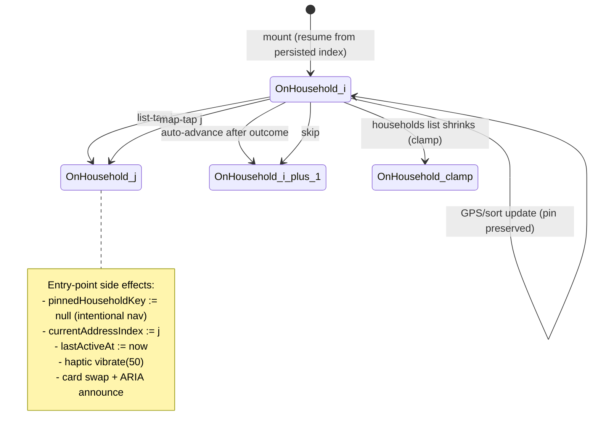

# Phase 108 — Active-House State Machine (SELECT-03 Audit)

**Scope:** The state machine governing which household is "active" in the
canvassing wizard, and how every entry point reaches a consistent target.

**Authored:** 2026-04-11
**Audit type:** Documentation + single behavioral integration test
  (per CONTEXT D-08 — NO XState refactor, NO useReducer extraction)

***

## State Variables

| Variable | Location | Persisted | Purpose |
|---|---|---|---|
| currentAddressIndex | canvassingStore | yes (sessionStorage) | Index into the ordered households list |
| pinnedHouseholdKey | useCanvassingWizard hook | no (in-memory) | Render-time pin preventing sort-flicker on GPS updates |
| lastActiveAt | canvassingStore | yes | Timestamp of last navigation for resume UX |
| sortMode | canvassingStore | yes | sequence or distance — affects household ordering |
| locationSnapshot | canvassingStore | yes | Last known coordinates for distance sort |

`pinnedHouseholdKey` is the load-bearing detail that caused 107-08.1 and
108-02 fixes: intentional navigation MUST clear it, sort-mode/GPS updates
MUST preserve it.

***

## State Diagram

***

## Transition Table

| # | Source | Trigger | Target | Side Effects | Clears pin? |
|---|---|---|---|---|---|
| 1 | On household i | DoorListView row tap (list-tap) | On household j | setPinnedHouseholdKey(null); storeJumpToAddress(j); vibrate(50); card swap; ARIA announce | yes |
| 2 | On household i | CanvassingMap marker tap (map-tap) | On household j | setPinnedHouseholdKey(null); storeJumpToAddress(j); vibrate(50); card swap; ARIA announce; map.panTo(lat,lng) | yes |
| 3 | On household i | House-level outcome submit (auto-advance) | On household i+1 | setPinnedHouseholdKey(null); storeAdvanceAddress(); toast + vibrate; card swap; ARIA announce | yes |
| 4 | On household i | Skip button tap | On household i+1 (next pending) | setPinnedHouseholdKey(null); storeSkipEntry(id); Undo toast; card swap | yes |
| 5 | (unmounted) | Route mount from sessionStorage | On household persistedIndex | zustand-persist merge → currentAddressIndex = persisted; pinnedHouseholdKey starts null and is re-set by render-time pin block | n/a (starts null) |
| 6 | On household i | GPS update / sortMode change | On household i (same) | pin preserved; list order may shift | no |
| 7 | On household i (where i >= households.length) | households list shrinks | On household clamp | storeJumpToAddress(households.length-1) via useLayoutEffect — uses RAW store action, does NOT clear pin | no |

**Key invariant:** Rows 1-4 (intentional navigation) all clear pin. Rows 6-7
(incidental index changes) preserve pin. This split is enforced in code by
the wrap-the-action pattern (Plan 108-02 + 107-08.1) — the hook-level
callbacks clear pin, the raw store actions do not.

***

## Entry Point Narrative

### 1. List-tap (SELECT-01)

**UI:** DoorListView row button. See `DoorListView.tsx:108-160`.
**Flow:** onClick → onJump(index) → handleJumpToAddress(index) → wrapped
callback clears pin → storeJumpToAddress → card swap → focus moves to
HouseholdCard address heading (existing route effect).
**Test coverage:** Plan 108-02 Task 2 (hook unit), Task 3 (render-path guard
in HouseholdCard.test.tsx), Plan 108-05 (behavioral state-machine test),
Plan 108-06 (E2E).

### 2. Map-tap (SELECT-02)

**UI:** CanvassingMap marker. See `CanvassingMap.tsx` (after Plan 108-03).
**Flow:** eventHandlers.click → handleMarkerClick → onHouseholdSelect(index)
→ handleJumpToAddress(index) → same wrap as list-tap → map.panTo with
reduced-motion gate.
**Test coverage:** Plan 108-03 Task 3 (component tests), Plan 108-05
(behavioral state-machine test), Plan 108-06 (E2E).

### 3. Auto-advance after outcome (CANV-01, inherited from phase 107)

**UI:** InlineSurvey / outcome button submit in HouseholdCard.
**Flow:** handleOutcome → HOUSE_LEVEL_OUTCOMES check → advanceAfterOutcome
→ wrapped advanceAddress (107-08.1) → clears pin → storeAdvanceAddress.
**Test coverage:** phase 107 plans 04, 08, 08.1.

### 4. Skip (CANV-02, inherited from phase 107)

**UI:** Skip button in HouseholdCard.
**Flow:** handleSkipAddress → wrapped skipEntry (107-08.1) → clears pin →
storeSkipEntry + advanceAddress → Undo toast.
**Test coverage:** phase 107 plans 05, 08, 08.1.

### 5. Resume

**UI:** ResumePrompt toast on mount when persisted state exists.
**Flow:** zustand-persist merge reads sessionStorage on store creation →
currentAddressIndex is already set before mount → ResumePrompt shows
"Pick up at door N of M" → onResume: () => {} (no mutation, leaves state
alone) OR onStartOver: handleJumpToAddress(firstPendingIdx).
**Pin behavior on resume:** pinnedHouseholdKey starts null (hook-local, not
persisted). The render-time pin block re-pins to whatever is at
currentAddressIndex on first render. No cross-session pin leak.
**Test coverage:** Plan 108-05 (behavioral test with seeded sessionStorage),
Plan 108-06 (E2E resume-after-navigation test).

***

## Reconciliation (deferred to phase 110)

This section is a PLACEHOLDER. Phase 110 (OFFLINE-01/02/03) will fill it in
as part of offline-queue hardening work.

**Open questions phase 110 must answer:**

1. **Active-house persistence on reconnect.** When the offline outcome queue
   replays after reconnect, does `currentAddressIndex` stay where the
   volunteer left it, or does it jump to whatever the last queued action
   implies?

2. **Server/client divergence.** If the server's last-active state
   (inferred from the last ingested outcome's `household_key`) differs from
   the client's `currentAddressIndex`, which wins? Client (volunteer intent
   is authoritative) or server (data-truth reconciliation)?

3. **Conflict surfacing.** How are reconciliation conflicts surfaced to the
   volunteer — silent merge, toast, modal, or a dedicated review queue?

4. **Queue ordering.** If the volunteer skipped a house offline and then
   activated it again (list-tap or map-tap) before the skip synced, which
   intent wins on reconcile?

Phase 108 deliberately leaves these unanswered per CONTEXT D-10. The
state machine above covers the ONLINE path only. Phase 110 extends it.

***

*Phase: 108-house-selection-active-state*
*Entry points (D-09): list-tap, map-tap, auto-advance, skip, resume*
*Reconciliation: deferred to phase 110 (D-10)*
